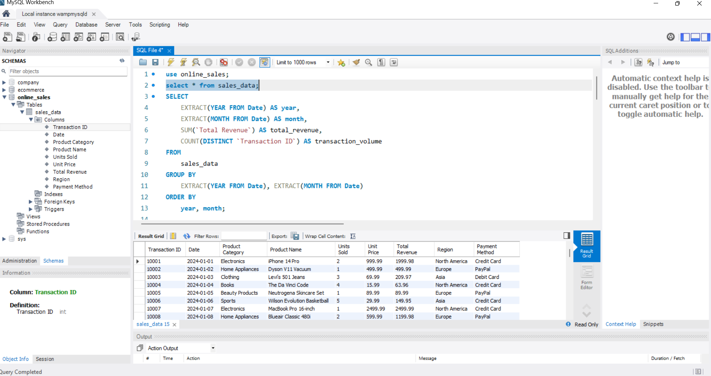
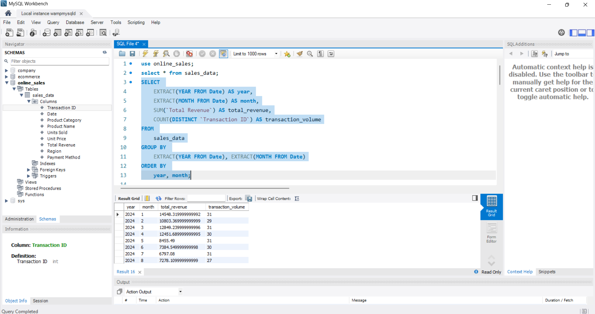
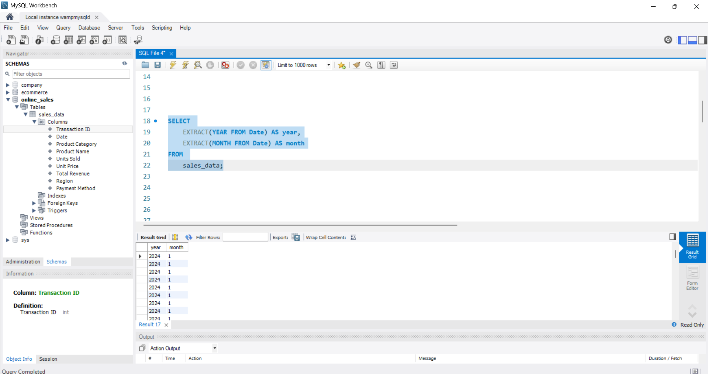
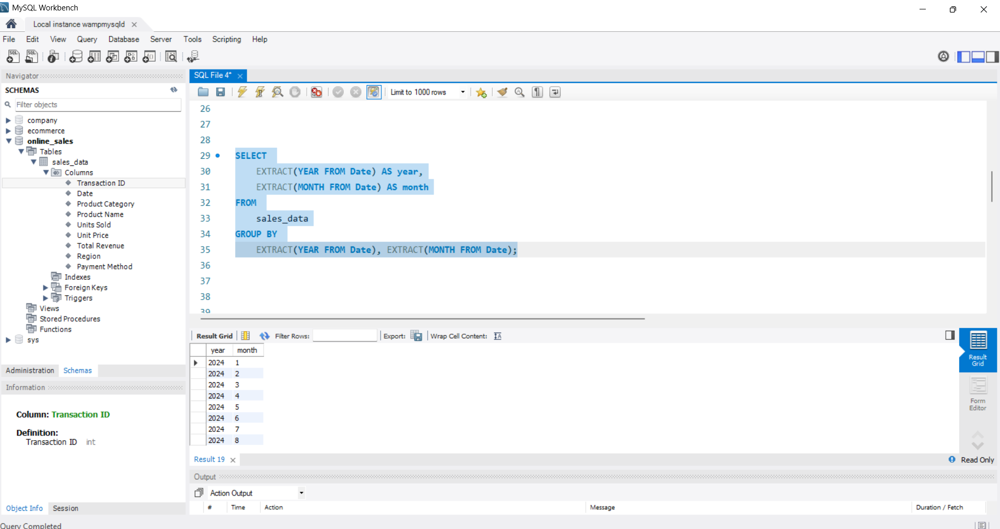
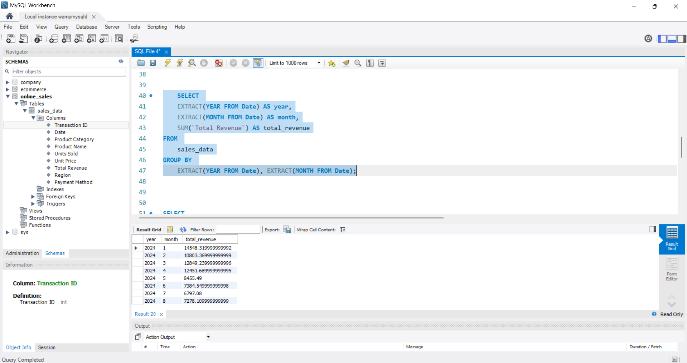
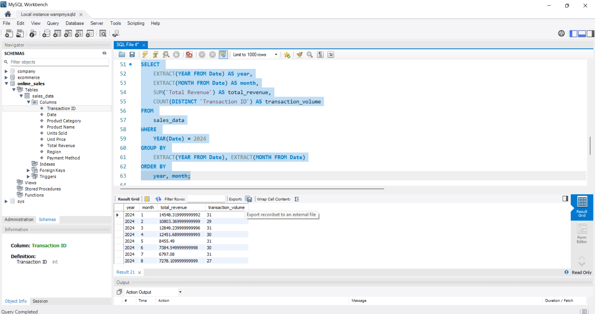

# online-sales-Trend-Analysis
Analyze monthly revenue and order volume.
## SQL Query Output

This screenshot shows the monthly revenue and order volume grouped by year and month.

## 📊 MySQL Queries and Results

### 🔹 Query 1: Orders on a Specific Date

---

### 🔹 Query 2: Orders in Q1 2023

---

### 🔹 Query 3: Products Priced Above $50

---

### 🔹 Query 4: Customers with More Than 5 Orders

---

### 🔹 Query 5: Total Quantity Sold per Product

---

### 🔹 Query 6: Orders Handled by Each Employee

